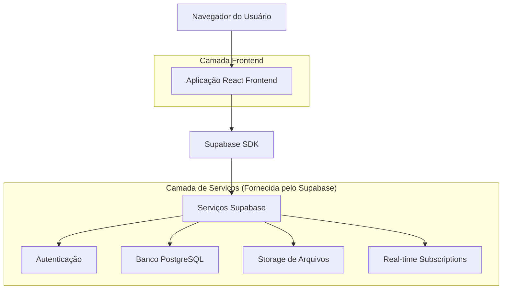
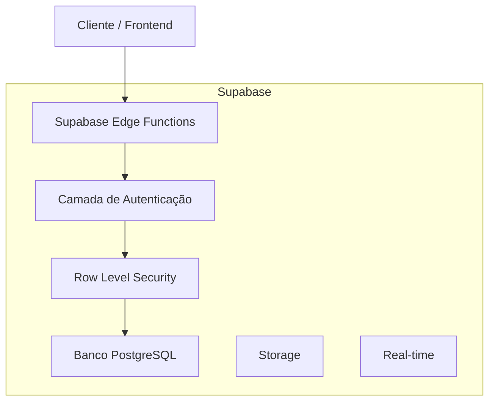
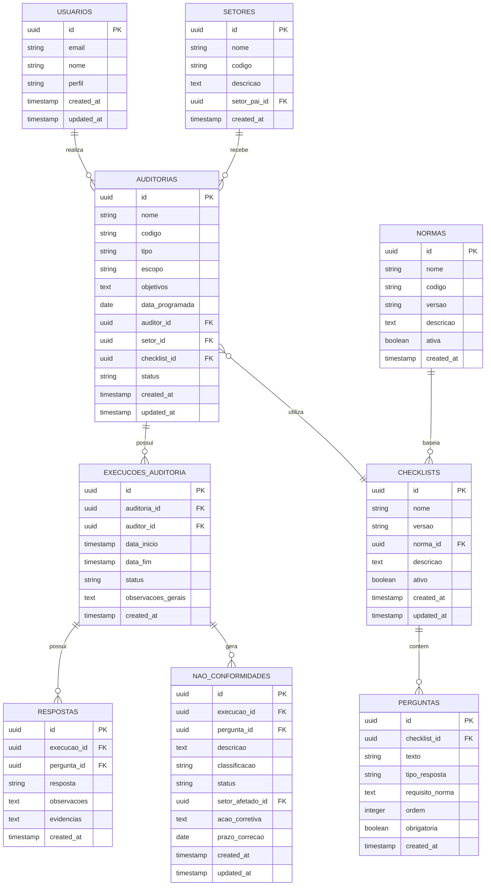

# Documento de Arquitetura Técnica - AuditaPro V2

## 1. Design da Arquitetura



## 2. Descrição das Tecnologias

- **Frontend**: React@18 + TypeScript + Vite + Tailwind CSS + Shadcn/UI
- **Backend**: Supabase (PostgreSQL + Auth + Storage + Real-time)
- **Formulários**: React Hook Form + Zod para validação
- **Tabelas**: TanStack Table para grids avançadas
- **Gráficos**: Recharts para dashboards e relatórios
- **Componentes UI**: Shadcn/UI com suporte a tema claro/escuro

## 3. Definições de Rotas

| Rota | Propósito |
|------|-----------|
| / | Página inicial - redirecionamento para /dashboard |
| /login | Página de autenticação de usuários |
| /dashboard | Dashboard principal com KPIs e visão geral |
| /auditorias | Lista de auditorias cadastradas |
| /auditorias/nova | Formulário para cadastrar nova auditoria |
| /auditorias/:id | Detalhes de uma auditoria específica |
| /auditorias/:id/executar | Interface para executar auditoria |
| /checklists | Lista de checklists disponíveis |
| /checklists/novo | Formulário para criar novo checklist |
| /checklists/:id | Editor de checklist específico |
| /nao-conformidades | Lista de não conformidades e parcialmente conformes |
| /nao-conformidades/:id | Detalhes de não conformidade específica |
| /configuracoes | Painel de configurações administrativas |
| /configuracoes/usuarios | Gestão de usuários e permissões |
| /configuracoes/setores | Configuração de setores e processos |
| /configuracoes/normas | Biblioteca de normas e requisitos |
| /relatorios | Geração e visualização de relatórios |
| /perfil | Perfil do usuário logado |

## 4. Definições de API

### 4.1 APIs Principais

**Autenticação de usuários**
```
POST /auth/v1/token
```

Requisição:
| Nome do Parâmetro | Tipo do Parâmetro | Obrigatório | Descrição |
|-------------------|-------------------|-------------|-----------|
| email | string | true | Email do usuário |
| password | string | true | Senha do usuário |

Resposta:
| Nome do Parâmetro | Tipo do Parâmetro | Descrição |
|-------------------|-------------------|-----------|
| access_token | string | Token JWT para autenticação |
| refresh_token | string | Token para renovação |
| user | object | Dados do usuário autenticado |

Exemplo:
```json
{
  "email": "auditor@empresa.com",
  "password": "senha123"
}
```

**Operações de Auditorias**
```
GET /rest/v1/auditorias
POST /rest/v1/auditorias
PUT /rest/v1/auditorias/:id
DELETE /rest/v1/auditorias/:id
```

**Operações de Checklists**
```
GET /rest/v1/checklists
POST /rest/v1/checklists
PUT /rest/v1/checklists/:id
DELETE /rest/v1/checklists/:id
```

**Operações de Não Conformidades**
```
GET /rest/v1/nao_conformidades
POST /rest/v1/nao_conformidades
PUT /rest/v1/nao_conformidades/:id
```

**Upload de Evidências**
```
POST /storage/v1/object/evidencias
```

## 5. Arquitetura do Servidor



## 6. Modelo de Dados

### 6.1 Definição do Modelo de Dados



### 6.2 Linguagem de Definição de Dados

**Tabela de Usuários (usuarios)**
```sql
-- Criar tabela
CREATE TABLE usuarios (
    id UUID PRIMARY KEY DEFAULT gen_random_uuid(),
    email VARCHAR(255) UNIQUE NOT NULL,
    nome VARCHAR(100) NOT NULL,
    perfil VARCHAR(20) DEFAULT 'auditor' CHECK (perfil IN ('admin', 'gestor', 'auditor', 'auditado')),
    ativo BOOLEAN DEFAULT true,
    created_at TIMESTAMP WITH TIME ZONE DEFAULT NOW(),
    updated_at TIMESTAMP WITH TIME ZONE DEFAULT NOW()
);

-- Criar índices
CREATE INDEX idx_usuarios_email ON usuarios(email);
CREATE INDEX idx_usuarios_perfil ON usuarios(perfil);

-- Políticas RLS
ALTER TABLE usuarios ENABLE ROW LEVEL SECURITY;
GRANT SELECT ON usuarios TO anon;
GRANT ALL PRIVILEGES ON usuarios TO authenticated;
```

**Tabela de Auditorias (auditorias)**
```sql
-- Criar tabela
CREATE TABLE auditorias (
    id UUID PRIMARY KEY DEFAULT gen_random_uuid(),
    nome VARCHAR(200) NOT NULL,
    codigo VARCHAR(50) UNIQUE NOT NULL,
    tipo VARCHAR(20) NOT NULL CHECK (tipo IN ('interna', 'externa')),
    escopo TEXT NOT NULL,
    objetivos TEXT NOT NULL,
    data_programada DATE NOT NULL,
    auditor_id UUID REFERENCES usuarios(id),
    setor_id UUID REFERENCES setores(id),
    checklist_id UUID REFERENCES checklists(id),
    status VARCHAR(20) DEFAULT 'planejada' CHECK (status IN ('planejada', 'em_andamento', 'concluida', 'cancelada')),
    created_at TIMESTAMP WITH TIME ZONE DEFAULT NOW(),
    updated_at TIMESTAMP WITH TIME ZONE DEFAULT NOW()
);

-- Criar índices
CREATE INDEX idx_auditorias_auditor_id ON auditorias(auditor_id);
CREATE INDEX idx_auditorias_setor_id ON auditorias(setor_id);
CREATE INDEX idx_auditorias_status ON auditorias(status);
CREATE INDEX idx_auditorias_data_programada ON auditorias(data_programada);

-- Políticas RLS
ALTER TABLE auditorias ENABLE ROW LEVEL SECURITY;
GRANT SELECT ON auditorias TO anon;
GRANT ALL PRIVILEGES ON auditorias TO authenticated;
```

**Tabela de Checklists (checklists)**
```sql
-- Criar tabela
CREATE TABLE checklists (
    id UUID PRIMARY KEY DEFAULT gen_random_uuid(),
    nome VARCHAR(200) NOT NULL,
    versao VARCHAR(10) NOT NULL,
    norma_id UUID REFERENCES normas(id),
    descricao TEXT,
    ativo BOOLEAN DEFAULT true,
    created_at TIMESTAMP WITH TIME ZONE DEFAULT NOW(),
    updated_at TIMESTAMP WITH TIME ZONE DEFAULT NOW()
);

-- Criar índices
CREATE INDEX idx_checklists_norma_id ON checklists(norma_id);
CREATE INDEX idx_checklists_ativo ON checklists(ativo);

-- Políticas RLS
ALTER TABLE checklists ENABLE ROW LEVEL SECURITY;
GRANT SELECT ON checklists TO anon;
GRANT ALL PRIVILEGES ON checklists TO authenticated;
```

**Tabela de Perguntas (perguntas)**
```sql
-- Criar tabela
CREATE TABLE perguntas (
    id UUID PRIMARY KEY DEFAULT gen_random_uuid(),
    checklist_id UUID REFERENCES checklists(id) ON DELETE CASCADE,
    texto TEXT NOT NULL,
    tipo_resposta VARCHAR(30) NOT NULL CHECK (tipo_resposta IN ('conforme', 'nao_conforme', 'supera', 'parcialmente_conforme', 'nao_se_aplica', 'escala', 'multipla_escolha')),
    requisito_norma TEXT,
    ordem INTEGER NOT NULL,
    obrigatoria BOOLEAN DEFAULT true,
    opcoes_resposta JSONB,
    created_at TIMESTAMP WITH TIME ZONE DEFAULT NOW()
);

-- Criar índices
CREATE INDEX idx_perguntas_checklist_id ON perguntas(checklist_id);
CREATE INDEX idx_perguntas_ordem ON perguntas(checklist_id, ordem);

-- Políticas RLS
ALTER TABLE perguntas ENABLE ROW LEVEL SECURITY;
GRANT SELECT ON perguntas TO anon;
GRANT ALL PRIVILEGES ON perguntas TO authenticated;
```

**Tabela de Não Conformidades (nao_conformidades)**
```sql
-- Criar tabela
CREATE TABLE nao_conformidades (
    id UUID PRIMARY KEY DEFAULT gen_random_uuid(),
    execucao_id UUID REFERENCES execucoes_auditoria(id),
    pergunta_id UUID REFERENCES perguntas(id),
    descricao TEXT NOT NULL,
    classificacao VARCHAR(20) NOT NULL CHECK (classificacao IN ('critica', 'maior', 'menor')),
    status VARCHAR(20) DEFAULT 'aberta' CHECK (status IN ('aberta', 'em_tratamento', 'fechada')),
    setor_afetado_id UUID REFERENCES setores(id),
    acao_corretiva TEXT,
    prazo_correcao DATE,
    responsavel_id UUID REFERENCES usuarios(id),
    created_at TIMESTAMP WITH TIME ZONE DEFAULT NOW(),
    updated_at TIMESTAMP WITH TIME ZONE DEFAULT NOW()
);

-- Criar índices
CREATE INDEX idx_nao_conformidades_execucao_id ON nao_conformidades(execucao_id);
CREATE INDEX idx_nao_conformidades_status ON nao_conformidades(status);
CREATE INDEX idx_nao_conformidades_classificacao ON nao_conformidades(classificacao);
CREATE INDEX idx_nao_conformidades_prazo ON nao_conformidades(prazo_correcao);

-- Políticas RLS
ALTER TABLE nao_conformidades ENABLE ROW LEVEL SECURITY;
GRANT SELECT ON nao_conformidades TO anon;
GRANT ALL PRIVILEGES ON nao_conformidades TO authenticated;
```

**Dados Iniciais**
```sql
-- Inserir normas padrão
INSERT INTO normas (nome, codigo, versao, descricao, ativa) VALUES
('ISO 9001', 'ISO9001', '2015', 'Sistema de Gestão da Qualidade', true),
('ISO 17025', 'ISO17025', '2017', 'Competência de Laboratórios de Ensaio e Calibração', true),
('ONA', 'ONA', '2021', 'Organização Nacional de Acreditação', true);

-- Inserir setores exemplo
INSERT INTO setores (nome, codigo, descricao) VALUES
('Recursos Humanos', 'RH', 'Departamento de Recursos Humanos'),
('Finanças', 'FIN', 'Departamento Financeiro'),
('Tecnologia da Informação', 'TI', 'Departamento de TI'),
('Produção', 'PROD', 'Departamento de Produção');
```