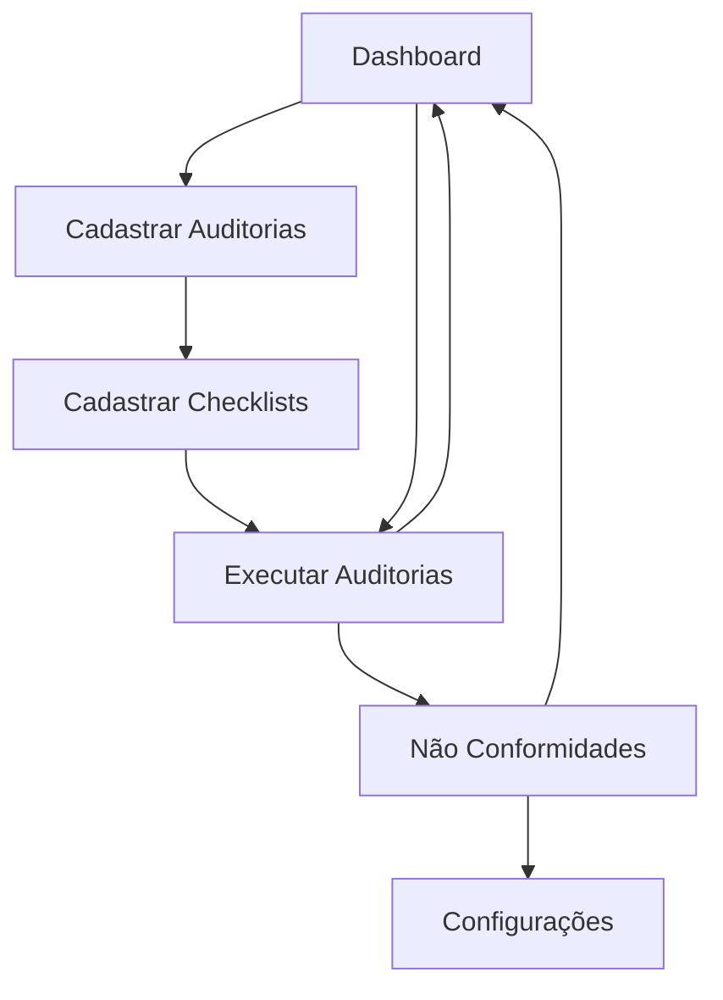

# Documento de Requisitos do Produto - AuditaPro V2

## 1. Visão Geral do Produto

O AuditaPro V2 é um sistema completo de gestão de auditorias que permite às organizações planejar, executar e acompanhar auditorias internas e externas de forma digital e eficiente. O sistema segue as diretrizes da ISO 19011 e suporta múltiplas normas como ISO 9001, ISO 17025 e ONA.

O produto resolve a necessidade de digitalização e padronização dos processos de auditoria, eliminando planilhas e documentos físicos, proporcionando rastreabilidade completa e relatórios em tempo real para gestores e auditores.

O sistema visa aumentar a eficiência das auditorias em 40% e reduzir o tempo de geração de relatórios de dias para minutos.

## 2. Funcionalidades Principais

### 2.1 Perfis de Usuário

| Perfil | Método de Cadastro | Principais Permissões |
|--------|-------------------|----------------------|
| Administrador | Cadastro direto no sistema | Acesso total: configurações, usuários, relatórios gerenciais |
| Gestor de Auditoria | Convite por administrador | Planejamento de auditorias, análise de resultados, aprovações |
| Auditor | Cadastro por gestor/admin | Execução de auditorias, criação de checklists, registro de evidências |
| Auditado | Convite para auditoria específica | Visualização de resultados, assinatura digital, upload de evidências |

### 2.2 Módulos Funcionais

O sistema AuditaPro V2 é composto pelos seguintes módulos principais:

1. **Dashboard**: painel executivo com metodologia One Page Report, KPIs de auditoria, gráficos de tendência e alertas críticos.
2. **Cadastrar Auditorias**: planejamento completo de auditorias seguindo ISO 19011, definição de escopo, critérios e seleção de checklists.
3. **Cadastrar Checklists**: criação de questionários estruturados vinculados a normas específicas com diferentes tipos de avaliação.
4. **Executar Auditorias**: interface para condução de auditorias em tempo real com registro de evidências e assinatura digital.
5. **Não Conformidades**: gestão automática de não conformidades e parcialmente conformes identificadas nas auditorias.
6. **Configurações**: módulo administrativo para usuários, setores, normas e integrações do sistema.

### 2.3 Detalhes das Páginas

| Nome da Página | Nome do Módulo | Descrição da Funcionalidade |
|----------------|----------------|----------------------------|
| Dashboard | Painel de KPIs | Exibir total de auditorias realizadas, pendentes, taxa de conformidade geral, não conformidades abertas/fechadas |
| Dashboard | Gráficos de Tendência | Mostrar auditorias mensais, conformidades vs não conformidades, evolução temporal |
| Dashboard | Indicadores por Setor | Apresentar percentual de conformidade por departamento (RH, Finanças, TI, Produção) |
| Dashboard | Desempenho de Auditores | Ranking e métricas de produtividade dos auditores |
| Dashboard | Alertas Críticos | Notificar auditorias próximas ao vencimento, não conformidades críticas, ações atrasadas |
| Cadastrar Auditorias | Informações Básicas | Inserir nome/código, tipo (interna/externa), escopo, objetivos da auditoria |
| Cadastrar Auditorias | Planejamento | Definir data programada, auditor responsável, equipe auditada, setor/processo |
| Cadastrar Auditorias | Critérios de Auditoria | Selecionar normas aplicáveis (ISO 9001, 17025, ONA), requisitos específicos, documentos de referência |
| Cadastrar Auditorias | Seleção de Checklist | Escolher checklists cadastrados aplicáveis à auditoria |
| Cadastrar Checklists | Cabeçalho do Checklist | Criar nome, associar norma/processo, definir versão e data de criação |
| Cadastrar Checklists | Estrutura de Perguntas | Configurar tipos de resposta: Conforme, Não Conforme, Supera, Parcialmente Conforme, N/A, escalas, múltipla escolha |
| Cadastrar Checklists | Requisitos da Norma | Vincular cada pergunta a requisitos específicos das normas ISO, ONA |
| Cadastrar Checklists | Campos de Evidências | Definir documentos necessários, registros fotográficos, observações obrigatórias |
| Executar Auditorias | Seleção de Auditoria | Escolher auditoria agendada e checklist aplicável para execução |
| Executar Auditorias | Interface de Execução | Responder questões do checklist, marcar conformidades/não conformidades de forma intuitiva |
| Executar Auditorias | Registro de Evidências | Upload de fotos, vídeos, documentos PDF sem limite de armazenamento |
| Executar Auditorias | Anotações Gerais | Inserir observações, contexto do problema, análise de causa raiz |
| Executar Auditorias | Assinatura Digital | Validar auditoria com assinatura do auditor e auditado |
| Executar Auditorias | Status em Tempo Real | Acompanhar progresso da auditoria, enviar notificações para responsáveis |
| Não Conformidades | Registro Automático | Capturar automaticamente NCs e PCs identificadas durante auditorias |
| Não Conformidades | Classificação | Categorizar desvios como crítica, maior ou menor, definir processo/setor afetado |
| Não Conformidades | Tratamento | Definir ações corretivas, responsáveis, prazos para resolução |
| Configurações | Usuários e Permissões | Cadastrar auditores, gestores, definir perfis de acesso e permissões |
| Configurações | Estrutura Organizacional | Configurar setores, processos e subprocessos da empresa |
| Configurações | Biblioteca de Normas | Gerenciar normas aplicáveis, requisitos customizados |
| Configurações | Templates | Criar modelos de relatórios, checklists padrão reutilizáveis |
| Configurações | Integrações | Configurar e-mail, calendários (Google/Outlook), ferramentas de BI |

## 3. Processo Principal

### Fluxo do Gestor de Auditoria:
1. Acessa o Dashboard para visão geral do status das auditorias
2. Cadastra nova auditoria definindo escopo, objetivos e critérios
3. Seleciona checklist apropriado ou solicita criação de novo
4. Designa auditor responsável e agenda execução
5. Acompanha execução em tempo real através de notificações
6. Analisa resultados e não conformidades identificadas
7. Aprova relatório final e define ações corretivas

### Fluxo do Auditor:
1. Visualiza auditorias designadas no Dashboard
2. Acessa módulo "Executar Auditorias" 
3. Seleciona auditoria agendada e checklist aplicável
4. Conduz auditoria respondendo questões e coletando evidências
5. Registra não conformidades e observações
6. Solicita assinatura digital do auditado
7. Finaliza auditoria e gera relatório automático

### Fluxo do Auditado:
1. Recebe notificação de auditoria agendada
2. Participa da execução fornecendo informações solicitadas
3. Acompanha registro de evidências e não conformidades
4. Assina digitalmente o relatório de auditoria
5. Recebe acesso aos resultados e ações definidas

## 4. Design da Interface do Usuário

### 4.1 Estilo de Design

- **Cores Primárias**: Azul corporativo (#2563eb), Verde conformidade (#16a34a), Vermelho não conformidade (#dc2626)
- **Cores Secundárias**: Cinza neutro (#64748b), Amarelo alerta (#eab308), Laranja parcialmente conforme (#ea580c)
- **Estilo de Botões**: Rounded corners (8px), sombras sutis, estados hover e focus bem definidos
- **Tipografia**: Inter como fonte principal, tamanhos 14px (corpo), 16px (subtítulos), 24px (títulos)
- **Layout**: Design baseado em cards, navegação lateral fixa, breadcrumbs para orientação
- **Ícones**: Lucide React icons, estilo outline, tamanho 20px padrão

### 4.2 Visão Geral do Design das Páginas

| Nome da Página | Nome do Módulo | Elementos da UI |
|----------------|----------------|-----------------|
| Dashboard | Painel de KPIs | Cards com números grandes, ícones coloridos, badges de status, gráficos de barras e linhas |
| Dashboard | Gráficos de Tendência | Charts responsivos com Recharts, filtros de período, legendas interativas |
| Dashboard | Indicadores por Setor | Progress bars coloridas, tooltips informativos, grid responsivo |
| Dashboard | Alertas Críticos | Lista com badges de prioridade, ícones de alerta, botões de ação rápida |
| Cadastrar Auditorias | Formulário Principal | Wizard multi-step, campos obrigatórios destacados, validação em tempo real |
| Cadastrar Checklists | Editor de Perguntas | Drag & drop para reordenar, preview em tempo real, tipos de input variados |
| Executar Auditorias | Interface de Execução | Layout mobile-first, botões grandes para touch, progress indicator |
| Não Conformidades | Lista e Detalhes | Tabela com filtros avançados, modal para detalhes, status coloridos |
| Configurações | Painel Administrativo | Tabs organizadas, formulários estruturados, confirmações de ações críticas |

### 4.3 Responsividade

O sistema é projetado com abordagem mobile-first, garantindo usabilidade completa em tablets e smartphones. A interface se adapta automaticamente a diferentes tamanhos de tela, com navegação otimizada para touch em dispositivos móveis. Componentes críticos como execução de auditorias são especialmente otimizados para uso em campo através de dispositivos móveis.